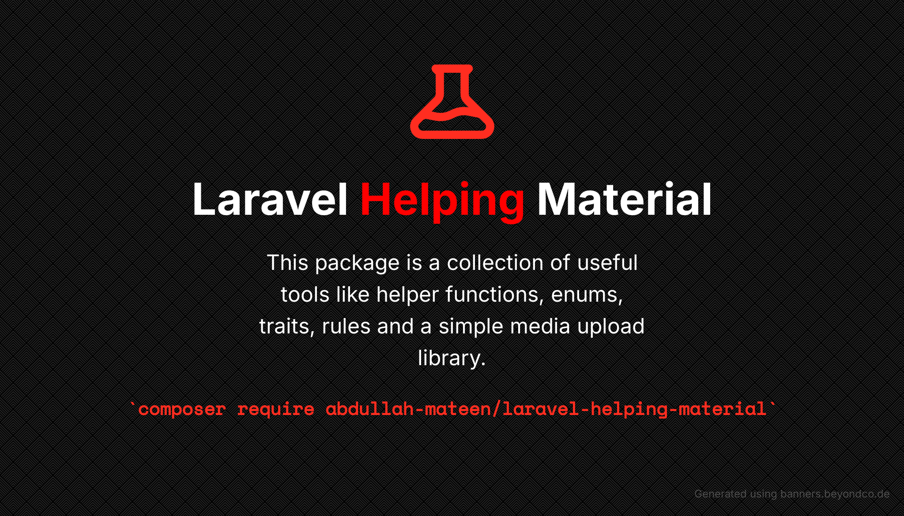
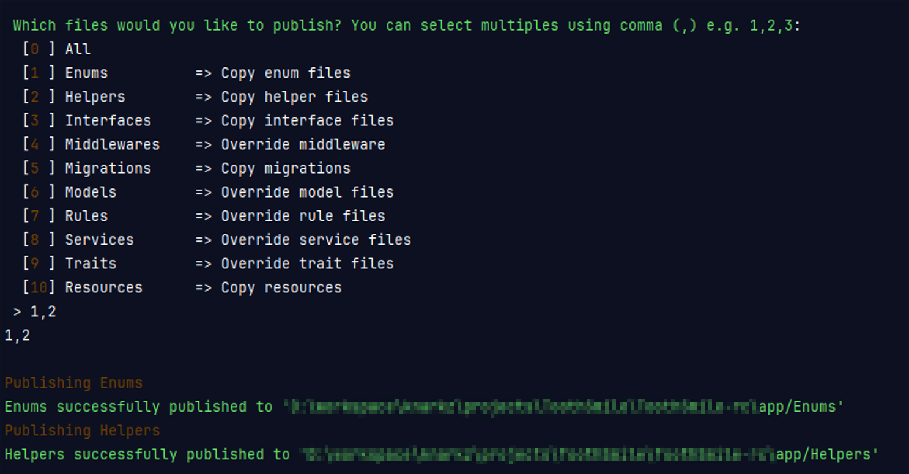

[](./images/banner.png)

<div align="center">

[](https://packagist.org/packages/abdullah-mateen/laravel-helping-metarial)
[](https://github.com/AbdullahMateen/laravel-helping-material/issues)
[](https://github.com/AbdullahMateen/laravel-helping-material)
[](https://github.com/AbdullahMateen/laravel-helping-material/network)
[](https://github.com/AbdullahMateen/laravel-helping-material/watchers)

</div>

# <p align="center">Laravel Helping Material</p>

> This package is a collection of useful tools for Laravel developers. It includes helper functions for common tasks, enums for defining constants, helpful traits for models and controllers, laravel validation rules for custom validations, and a simple media upload library for handling file uploads. This package aims to make Laravel development easier and faster.

## Table of contents

- [Getting Started](#getting-started)
- [Prerequisites](#prerequisites)
- [Installation](#installation)
- [Publish](#publish)
- [Usage](#usage)
    - [Enums](#enums)
    - [Helpers](#helpers)
    - [Interface](#interface)
    - [Middleware](#middleware)
    - [Models](#models)
    - [Resources](#resources)
    - [Resources](#resources)
    - [Rules](#rules)
    - [Simple Media Library](#simple-media-library)
- [Authors](#author)
- [License](#license)

## Getting Started

This package offers a variety of features to enhance your web development experience. Some of the features are:

- Enums: Define and use enum types in your code for better readability and consistency.
- Helpers: Use handy functions and macros to simplify common tasks and operations.
- Colors Interface: A list of colors classes and RGBA codes.
- Authorization Middleware: Protect your routes and controllers with customizable authorization logic.
- General Model: Use a base model class that provides common functionality and traits for your models.
- Helpful Css: Apply some useful css classes to your elements (if you are not using tailwind).
- Validation Rules: Validate your data with custom rules and messages.
- Some Helpful Traits: Use traits to add behavior and functionality to your enums, classes and controllers.
- Simple Media Library: Manage your media files and attachments with ease.

This package is designed to help you with your web development projects. We hope you find it useful and enjoyable.

## Prerequisites

[(Back to top)](#table-of-contents)

This project requires PHP `(version 8.1 or later)` you can use [xampp](https://www.apachefriends.org/), [wamp](https://www.wampserver.com/en/), [laragon](https://laragon.org/index.html) or any other option that is suitable to you, they are really easy to install. To make sure you have them available on your machine, try running the following command.

```sh
$ php -v
8.1.6
```

## Installation

[(Back to top)](#table-of-contents)

Require this package with composer using the following command:

```sh
composer require abdullah-mateen/laravel-helping-material
```

## Publish

[(Back to top)](#table-of-contents)

You can use the publish command to publish all the files. This will allow you to modify the files as you wish. To publish your files, you need to execute this command in `PowerShell`, `cmd` or any other `terminal`.

```sh
php artisan lhm:publish
```

Once you run the above command it will display a menu of files to publish. You can select one or more files by typing their numbers separated by commas, as shown below:

[](./images/lhm-publish-selection.png)

## Usage

### Enums

[(Back to top)](#table-of-contents)

This package is using `php` default enums which are available from `(PHP 8 >= 8.1.0)` onward.

| Dir   | Enums                                         | Description                                                                                                                                                                    |
|-------|-----------------------------------------------|--------------------------------------------------------------------------------------------------------------------------------------------------------------------------------|
| Media | MediaDiskEnum<br/>MediaTypeEnum               | Both `enums` are related to `Media` model which is also included in this package.<br/>Mostly used in [`Simple Media Library`](#simple-media-library) which is documented below |
| User  | AccountStatusEnum<br/>GenderEnum<br/>RoleEnum | These enums are related to `User` model which are mostly/commonly used wherever there is a user                                                                                |
|       | StatusEnum                                    | General `Status` enum like to manage active/inactive statuses of a model                                                                                                       |

#### Example

```php
use \AbdullahMateen\LaravelHelpingMaterial\Enums\User\AccountStatusEnum;
use \AbdullahMateen\LaravelHelpingMaterial\Enums\User\GenderEnum;
use \AbdullahMateen\LaravelHelpingMaterial\Enums\User\RoleEnum;

class User extends Authenticatable {
    
    protected $casts = [
        'role'   => RoleEnum::class,
        'gender' => GenderEnum::class,
        'status' => AccountStatusEnum::class,
    ];
    
    // ...
}

User::create([
    'name'     => 'John Doe',
    'email'    => 'example@example.com',
    'password' => Hash::male('password'),
    'role'     => RoleEnum::Customer, // or you can use its value RoleEnum::Customer->value
    'gender'   => GenderEnum::Male, // or you can use its value GenderEnum::Male->value
    'status'   => AccountStatusEnum::Unverified, // or you can use its value AccountStatusEnum::Unverified->value
]);
```

> <span style="color: orange">**Note:** if you are going to use these enums as values then you don't need to cast them to enums.</span>

### Helpers

[(Back to top)](#table-of-contents)

*<small style="color: #f00;font-weight: bold;">list of helper functions will be available soon.</small>* For now you can have a look at available functions [here](https://github.com/AbdullahMateen/laravel-helping-material/tree/1.x/src/Helpers)

The helper functions are not automatically registered by default. To utilize these helper functions, you must first publish them using the command `php artisan lhm:publish` and select the helper functions options. Afterward, navigate to your `composer.json` file and perform the following steps:

```json
{
  "autoload": {
    "files": [
      "src/Helpers/helpers.php"
    ]
  }
}
```

Finally, run the command `composer dump-autoload` or its shorthand `composer du` in your current directory terminal.

#### Example

```php
$user = auth_user();

$routeName = route_url_to_name('https://example.com') // will return 'index'

if (is_current_route('dashboard')) {
    // do something
}

// and much more ...
```

### Interface

[(Back to top)](#table-of-contents)

| Interface       | Description                                                                                                                                                                                          |
|-----------------|------------------------------------------------------------------------------------------------------------------------------------------------------------------------------------------------------|
| ColorsInterface | This interface contain a list of `color classes` and `color codes` of those classes for this you also need `sass` file which contain those classes.<br/>That `sass` file is included in this package |

#### Example

```php
use \AbdullahMateen\LaravelHelpingMaterial\Interfaces\ColorsInterface;
use \AbdullahMateen\LaravelHelpingMaterial\Enums\User\AccountStatusEnum;

class Example implements ColorsInterface {
    
    protected $casts = [
        'status' => AccountStatusEnum::class,
    ];
    
    public function getColorClass() {
        return 'bg-' . self::SUCCESS_CLASS // bg-success: for background colors
        // return self::SUCCESS_CLASS // success: for text colors
    }
    
    public function getColorCode() {
        return self::SUCCESS // #28a745
    }
    
    public function getStatusColor() {
        return $this->status->color(); // Using Enum 'color' function
    }
    
}
```

> you can see another examples in-use in Enums [here](https://github.com/AbdullahMateen/laravel-helping-material/tree/1.x/src/Helpers)

### Middleware

[(Back to top)](#table-of-contents)

| Middleware              | usage                      | Description                                                       |
|-------------------------|----------------------------|-------------------------------------------------------------------|
| AuthorizationMiddleware | `authorize:1001,3001,5001` | This middleware is used to authorize users based on their levels. |

The middleware is pre-registered, but if you have published it using the command `php artisan lhm:publish` and selected the middleware option, you will receive an overridden file for the same middleware. In such cases, it's necessary to manually register the middleware. To do so, follow these steps in the `app\Http\Kernel.php` file:

```php
  // ...

  protected $routeMiddleware = [
      // ...
    
      'custom-authorize' => \App\Http\Middleware\Custom\AuthorizationMiddleware::class,
  ];
```

#### Example

```php
// web.php File

use \AbdullahMateen\LaravelHelpingMaterial\Enums\User\RoleEnum;

Route::get('/dashboard', [DashboardController::class, 'index'])->middleware('authorize:1001,3001')

Route::get('/dashboard', [DashboardController::class, 'index'])->middleware('authorize:' . RoleEnum::column('value', 'admins', true))

// if you have published it 
Route::get('/dashboard', [DashboardController::class, 'index'])->middleware('custom-authorize:1001,3001')
```

> take a look at AuthorizationMiddleware [here](https://github.com/AbdullahMateen/laravel-helping-material/tree/1.x/src/Helpers)

### Models

[(Back to top)](#table-of-contents)

### Resources

[(Back to top)](#table-of-contents)

### Rules

[(Back to top)](#table-of-contents)

### Simple Media Library

[(Back to top)](#table-of-contents)

[//]: # (## Contributing)

[//]: # ()
[//]: # ([&#40;Back to top&#41;]&#40;#table-of-contents&#41;)

[//]: # (Please read [CONTRIBUTING.md]&#40;CONTRIBUTING.md&#41; for details on our code of conduct, and the process for submitting pull requests to us.)

[//]: # ()
[//]: # (1. Fork it!)

[//]: # (2. Create your feature branch: `git checkout -b my-new-feature`)

[//]: # (3. Add your changes: `git add .`)

[//]: # (4. Commit your changes: `git commit -am 'Add some feature'`)

[//]: # (5. Push to the branch: `git push origin my-new-feature`)

[//]: # (6. Submit a pull request :sunglasses:)

## Author

[(Back to top)](#table-of-contents)

* **[Abdullah Mateen](https://github.com/AbdullahMateen/laravel-helping-material)** - *abdulahmateen101@gmail.com* 

## License

[(Back to top)](#table-of-contents)

The MIT License (MIT) 2024 - [Abdullah Mateen](https://github.com/AbdullahMateen/laravel-helping-material). Please have a look at the [LICENSE.md](./LICENSE) for more details.
